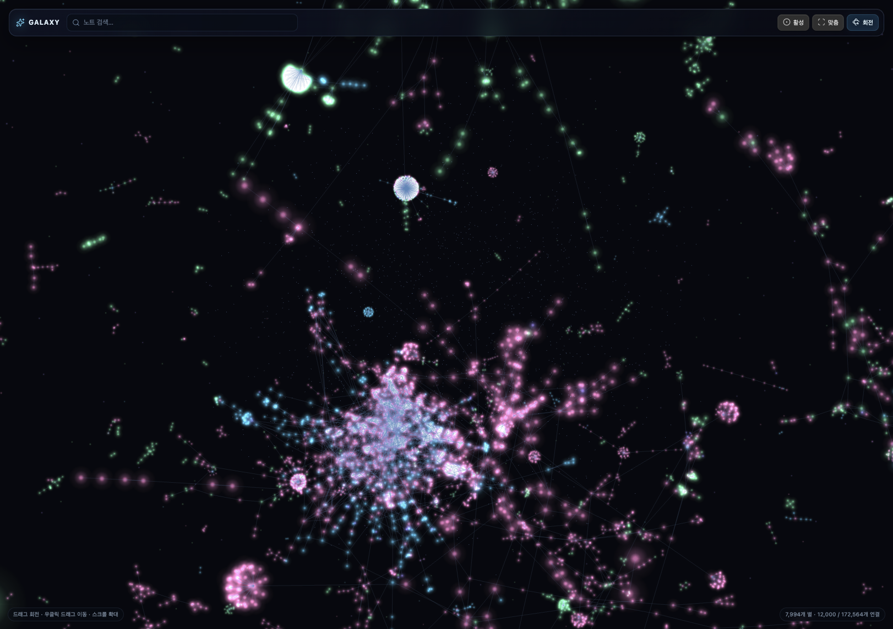

# Galaxy Graph

Galaxy Graph is a desktop-only Obsidian plugin that renders Markdown notes and
their resolved links as a translucent, navigable 3D galaxy.



## First version

- A dedicated `Galaxy Graph` workspace view (the core Graph view is untouched)
- Star cores, additive halos, depth fog, and a subtle background star field
- Folder-based colors and node sizes based on connection count
- Orbit, pan, zoom, hover labels, search, and click-to-open
- Local-neighborhood focus for the active note
- Live rebuilds after metadata changes, note renames, or deletes
- Controls for glow, node scale, link opacity, label behavior, and rotation
- Automatic large-vault mode with compact stars, lighter fog, and a configurable
  link cap that preserves strong links and broad node coverage

## Development

```bash
npm install
npm run build
```

Copy `main.js`, `manifest.json`, and `styles.css` to:

```text
<vault>/.obsidian/plugins/galaxy-graph/
```

Then enable **Galaxy Graph** in Obsidian's Community plugins settings.

Large vaults automatically switch to compact star sprites, lighter depth fog,
and a capped link set. Every note remains visible; strong links and broad node
coverage are prioritized. The link cap is configurable in plugin settings.

## Controls

- Drag: orbit
- Right-drag: pan
- Wheel or pinch: zoom
- Hover: show note and path
- Click a star: open the note
- Search: dim unrelated stars and select the closest title match
- `Fit`: frame the visible galaxy
- `Active`: focus the active note and its immediate neighbors

## License

MIT
